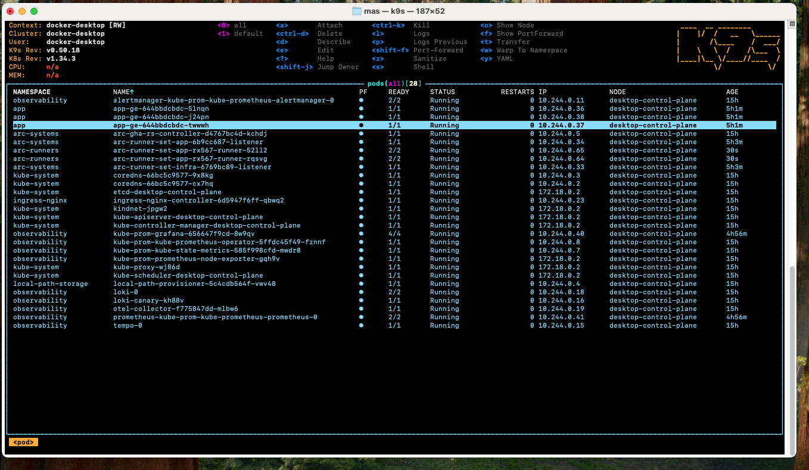
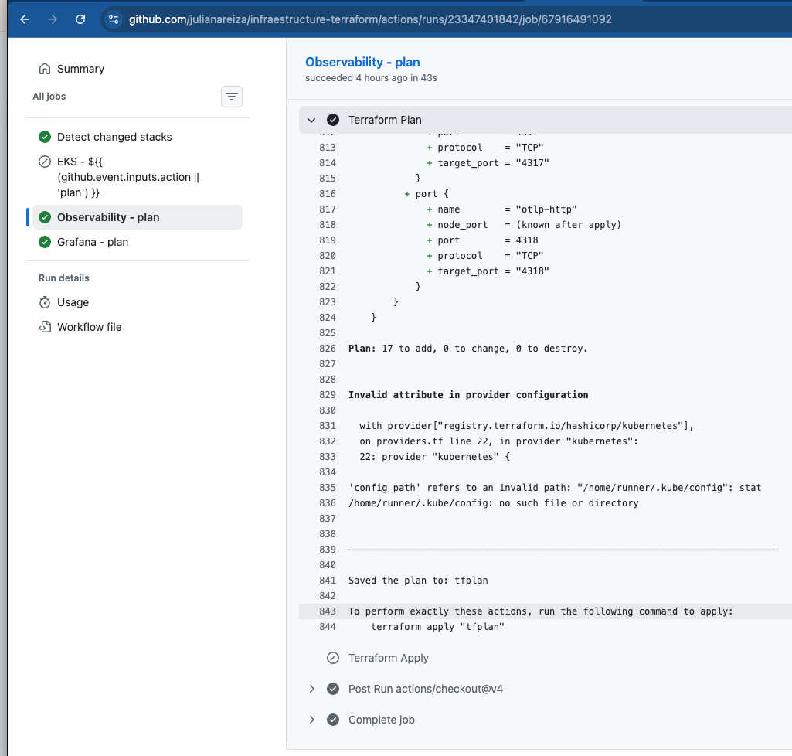
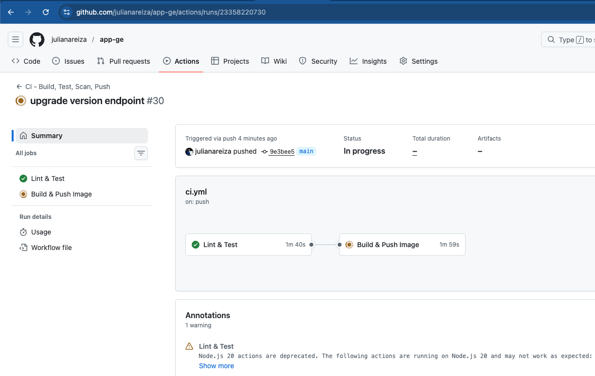
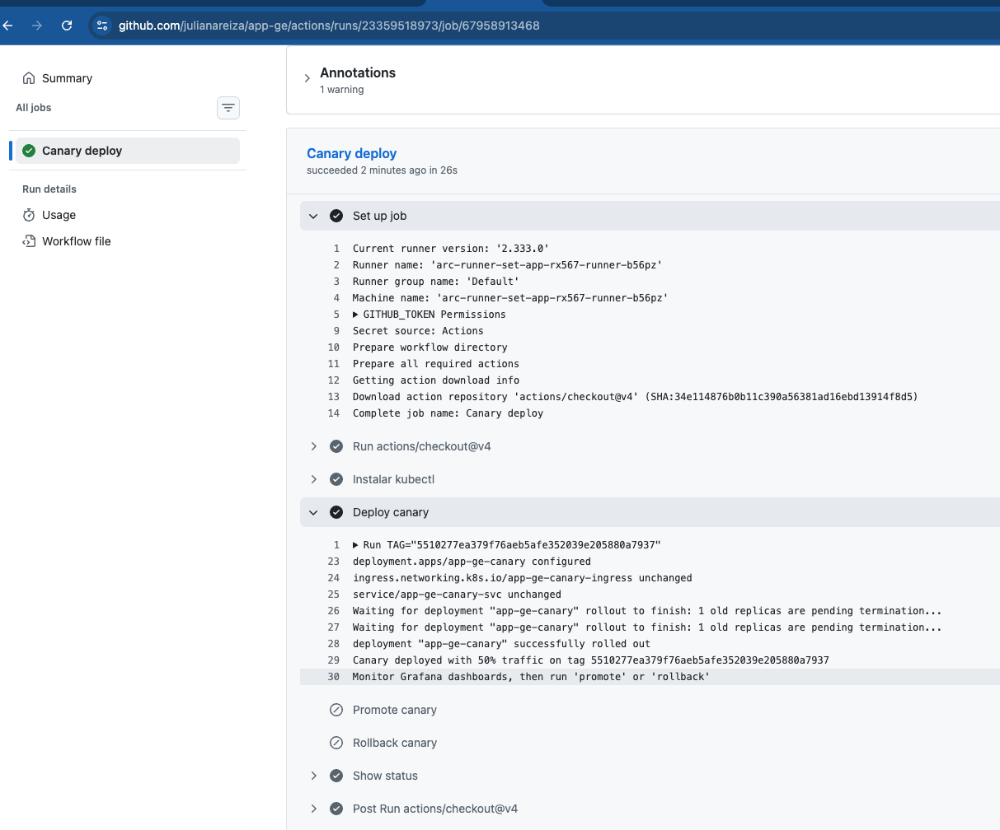

# Infraestructure Terraform


## Decisiones de Arquitectura y Proceso

### 1. Cloud Provider: AWS

Se eligio AWS como proveedor cloud por su madurez en servicios gestionados de Kubernetes (EKS), IAM granular y ecosistema de herramientas de observabilidad.

**State Backend en S3:** El estado de Terraform se almacena en un bucket S3 con versionamiento habilitado. Esto garantiza:
- Estado compartido entre miembros del equipo
- Historial de cambios en la infraestructura
- Locking con DynamoDB para evitar escrituras concurrentes
- Para desarrollo local se usa backend `local` y se puede alternar comentando/descomentando en `backend.tf`

### 2. EKS con acceso privado

El cluster EKS se configura con `endpoint_private_access: true` y `endpoint_public_access: true`. Las decisiones de seguridad:
- Los nodos corren en **subnets privadas** sin acceso directo a internet
- La VPC y subnets se asumen pre-existentes y se referencian por **Name tags** usando `data sources`, evitando hardcodear IDs
- IAM roles separados para el cluster y los nodos, siguiendo el principio de **least privilege**
- OIDC provider habilitado para **IRSA** (IAM Roles for Service Accounts), permitiendo que pods individuales tengan permisos AWS granulares sin compartir credenciales del nodo

### 3. Actions Runner Controller (ARC)

Se instala ARC en el cluster para que los workflows de GitHub Actions se ejecuten como pods dentro del propio cluster. Esto implica:

- **Self-hosted runners efimeros:** cada job levanta un pod runner que se destruye al terminar, evitando contaminacion entre builds
- **RBAC via Terraform:** se crean ServiceAccounts (`arc-runner-sa-app`, `arc-runner-sa-infra`) con ClusterRoleBindings que otorgan permisos para desplegar recursos de Kubernetes
- **Separacion por repositorio:** cada repo tiene su propio runner set (`arc-runner-set-app`, `arc-runner-set-infra`) con permisos independientes
- **GitHub token como variable sensible:** el `github_token` se pasa via `TF_VAR_arc_github_token` desde GitHub Secrets, nunca hardcodeado
- **Modo DinD (Docker in Docker):** los runners pueden construir imagenes Docker dentro del pod

### 4. Estructura del repositorio: DRY (Don't Repeat Yourself)

```
infraestructure-terraform/
├── modules/                    # Logica reutilizable
│   ├── eks/                    # Cluster EKS, IAM, Node Groups, OIDC
│   ├── ecr/                    # Repositorios de imagenes Docker
│   ├── observability/          # Helm charts + OTel Collector + RBAC
│   └── grafana/                # Folders, dashboards, alert rules
├── stacks/                     # Instancias de modulos por contexto
│   ├── eks/                    # Stack AWS (cluster + ECR)
│   ├── observability/          # Stack Kubernetes (charts + namespaces)
│   └── grafana/                # Stack Grafana (dashboards + alertas)
├── local-scripts/              # Scripts auxiliares para desarrollo local
└── .github/workflows/          # CI/CD pipelines
```

**Modulos** encapsulan la logica de infraestructura. **Stacks** son instancias que consumen modulos con variables especificas por ambiente. Esta separacion permite:
- Reutilizar modulos en multiples ambientes sin duplicar codigo
- Testear modulos de forma independiente
- Cambiar un modulo y que todos los stacks que lo consumen se beneficien

### 5. Terraform como Single Source of Truth

Toda la infraestructura esta definida como codigo en Terraform, incluyendo:

| Recurso | Herramienta | Modulo |
|---|---|---|
| Cluster EKS, IAM, Node Groups | `aws` provider | `modules/eks` |
| ECR Repositories | `aws` provider | `modules/ecr` |
| Namespaces Kubernetes | `kubernetes` provider | `modules/observability` |
| Prometheus, Grafana, Loki, Tempo | `helm` provider | `modules/observability` |
| Ingress NGINX Controller | `helm` provider | `modules/observability` |
| OTel Collector (ConfigMap + Deployment + Service) | `kubernetes` provider | `modules/observability` |
| ARC Controller + Runner Sets + RBAC | `helm` + `kubernetes` provider | `modules/observability` |
| Grafana Folders, Dashboards, Alert Rules | `grafana` provider | `modules/grafana` |

Esto elimina la configuracion manual y permite reconstruir toda la infraestructura desde cero con `terraform apply`.

### 6. Estrategia Multi-Environment con Terraform Workspaces

Cada stack soporta multiples ambientes usando **Terraform Workspaces** y archivos JSON de variables:

```
stacks/observability/
├── vars/
│   ├── development.json     # Variables de desarrollo
│   ├── staging.json         # Variables de staging (futuro)
│   └── production.json     # Variables de produccion (futuro)
```

Para desplegar en un ambiente:
```bash
terraform workspace select development
terraform apply
```

Las variables sensibles (tokens, credenciales) se pasan via `TF_VAR_*` desde GitHub Secrets, nunca en archivos JSON.

### 7. Pipeline de CI/CD con deteccion de cambios

El workflow `terraform.yml` detecta automaticamente que stacks fueron modificados y solo ejecuta plan/apply en los afectados:

```
Push a main → detect-changes → solo los stacks modificados corren
```

- **`stacks/eks/` o `modules/eks/` cambiaron** → corre job EKS
- **`stacks/observability/` o `modules/observability/` cambiaron** → corre job Observability
- **`stacks/grafana/` o `modules/grafana/` cambiaron** → corre job Grafana

Tambien soporta **ejecucion manual** (`workflow_dispatch`) donde se elige stack, accion (plan/apply) y workspace. Cada job tiene un **Approval Gate** comentado, listo para activar cuando se requiera aprobacion humana antes del apply.

### 8. Stack de Observabilidad

La observabilidad sigue el modelo de los **tres pilares**:

| Pilar | Herramienta | Funcion |
|---|---|---|
| Metricas | Prometheus | Recoleccion y almacenamiento de metricas |
| Logs | Loki | Agregacion de logs |
| Traces | Tempo | Distribucion de trazas |
| Visualizacion | Grafana | Dashboards, alertas, correlacion |
| Recoleccion | OTel Collector | Punto unico de recepcion OTLP |

**Flujo de telemetria:**
```
App (OTLP) → OTel Collector → Prometheus (metricas)
                             → Loki (logs)
                             → Tempo (traces)
                                    ↓
                              Grafana (consulta los 3)
```

La app solo conoce una direccion: `otel-collector.observability:4317`. El Collector se encarga del routing a cada backend. Esto desacopla la instrumentacion de la infraestructura de observabilidad.

### 9. Alertas como codigo

Las alertas se definen en dos niveles:

**Prometheus Rules** (en `kube-prometheus-stack.yml`):
- HTTP 401 Unauthorized: `rate(http_requests_total{http_status_code="401"}[5m]) > 0`
- HTTP 404 Not Found: `rate(http_requests_total{http_status_code="404"}[5m]) > 5`

**Grafana Alert Rules** (via Terraform en `modules/grafana`):
- HTTP 401 Unauthorized (Prometheus datasource)
- HTTP 404 Not Found (Prometheus datasource)
- Application Error Logs (Loki datasource): detecta cualquier log con nivel ERROR en el namespace `app`

AlertManager agrupa, silencia y rutea las alertas. Los receivers estan preparados para configurar webhooks (Slack, email, PagerDuty).

### 10. Seguridad (DevSecOps)

| Practica | Implementacion |
|---|---|
| Secrets gestionados | GitHub Secrets → `TF_VAR_*`, nunca en codigo |
| RBAC en Kubernetes | ServiceAccounts con ClusterRoles especificos por runner |
| Escaneo de vulnerabilidades | Trivy en el pipeline de la app (bloquea en HIGH/CRITICAL) |
| Analisis estatico de codigo | SonarCloud en el pipeline de la app |
| Analisis de seguridad | Bandit para Python |
| Linting | Ruff para estilo y formato |
| Estado remoto seguro | S3 con versionamiento + DynamoDB locking |
| Imagenes minimales | Python slim como base, sin dependencias innecesarias |
| Runners efimeros | Pods destruidos despues de cada job, sin estado residual |
| Ingress centralizado | Un solo punto de entrada con NGINX, metricas habilitadas |

### 11. Desarrollo local con Docker Desktop

La infraestructura esta disenada para funcionar tanto en AWS como en Docker Desktop local:

- `providers.tf` usa `config_path = ~/.kube/config` con contexto `docker-desktop` cuando `use_eks = false`
- `backend.tf` alterna entre `local` y `s3`
- Los Helm charts y recursos Kubernetes son identicos en ambos entornos
- Script `local-scripts/observability.sh` como alternativa para instalacion manual sin Terraform

### 12. Grafana como codigo

El stack de Grafana usa el provider oficial `grafana/grafana` para gestionar:
- **Folders**: organizacion logica de dashboards (App GE, Infrastructure)
- **Dashboards**: importados desde archivos JSON exportados de la UI
- **Alert Rules**: las 3 alertas del punto 5 definidas como `grafana_rule_group`

La autenticacion usa **Service Account Tokens** en lugar de credenciales basicas, siguiendo el principio de minimo privilegio y auditabilidad.

### 13. Instrumentacion de la aplicacion

La app FastAPI se instrumenta con OpenTelemetry SDK directamente en `main.py`:
- **Traces**: `FastAPIInstrumentor` intercepta automaticamente cada request HTTP
- **Metricas**: contador `http_requests_total` con labels `method`, `route`, `status_code` via middleware custom
- **Logs**: `LoggingInstrumentor` enriquece logs con trace_id y span_id para correlacion

La instrumentacion es **condicional** (`OTEL_ENABLED=true/false`) y los exporters fallan silenciosamente si el collector no esta disponible, permitiendo desplegar la app independientemente de la infraestructura de observabilidad.

---

## Quick Start

### Prerequisitos
- Terraform >= 1.5
- kubectl
- Helm
- Docker Desktop con Kubernetes habilitado

### Desplegar observabilidad en local
```bash
cd stacks/observability
terraform init
terraform workspace new development
export TF_VAR_arc_github_token="tu-github-pat"
terraform apply
```

### Desplegar alertas de Grafana
```bash
cd stacks/grafana
terraform init
terraform workspace new development
export TF_VAR_grafana_token="tu-grafana-sa-token"
terraform apply
```

### Acceder a servicios
```bash
kubectl port-forward svc/ingress-nginx-controller 8080:80 -n ingress-nginx
# http://julian-areiza-el-mas-crack:8080/          → App
# http://julian-areiza-el-mas-crack:8080/grafana    → Grafana
# http://julian-areiza-el-mas-crack:8080/prometheus → Prometheus
```

---

## CI/CD Pipeline de la Aplicacion (app-ge)


El pipeline de la aplicacion implementa el modelo **Shift Left Security**, donde las validaciones de seguridad y calidad se ejecutan lo mas temprano posible en el ciclo de desarrollo, reduciendo el costo de corregir defectos.

### CI Pipeline (`ci.yml`)

El pipeline de integracion continua se divide en dos jobs secuenciales:

#### Job 1: Lint, Test & Scan

| Step | Herramienta | Proposito | Practica DevSecOps |
|---|---|---|---|
| Lint & Format | **Ruff** | Estilo de codigo consistente, deteccion de errores estaticos | Code Quality Gate |
| Security Scan | **Bandit** | Deteccion de vulnerabilidades en codigo Python (SQL injection, hardcoded passwords, insecure functions) | SAST (Static Application Security Testing) |
| Tests + Coverage | **Pytest** | Tests unitarios con reporte de cobertura en XML | Quality Assurance |
| Analisis de calidad | **SonarCloud** | Code smells, duplicaciones, deuda tecnica, coverage tracking | Continuous Inspection |

Este job actua como **Quality Gate**: si el linting, los tests o el analisis de seguridad fallan, el pipeline se detiene y no se construye la imagen.

#### Job 2: Build, Push & Scan Image

| Step | Herramienta | Proposito | Practica DevSecOps |
|---|---|---|---|
| Build multi-arch | **Docker Buildx + QEMU** | Imagen para `linux/amd64` y `linux/arm64` | Portabilidad |
| Push | **DockerHub** | Registro de imagenes con tag de commit SHA y `latest` | Trazabilidad de versiones |
| Vulnerability Scan | **Trivy** | Escaneo de CVEs en la imagen (OS packages + dependencias Python) | Container Security / SCA |

Trivy bloquea el pipeline si encuentra vulnerabilidades **HIGH** o **CRITICAL**, asegurando que imagenes vulnerables no lleguen a produccion.

### CD Pipeline (`cd.yml`)

El pipeline de despliegue continuo se dispara automaticamente despues del CI exitoso:

1. **Crea el namespace** si no existe (`kubectl create namespace app --dry-run=client`)
2. **Aplica los manifiestos** de Kubernetes (`kubectl apply -f k8s/base/`)
3. **Actualiza la imagen** del deployment con el SHA del commit

El deploy se ejecuta en un **runner ARC** dentro del propio cluster, lo que significa que:
- No se exponen credenciales de Kubernetes fuera del cluster
- El runner tiene permisos RBAC especificos (no usa `cluster-admin`)
- El pod runner se destruye al terminar, sin dejar estado residual

### Por que es buena practica DevSecOps

```
Code → Lint → SAST → Tests → SonarCloud → Build → Trivy → Push → Deploy
        ↑       ↑       ↑        ↑                   ↑
    Quality  Security  Quality  Continuous         Container
     Gate     Gate     Gate    Inspection          Security
```

1. **Shift Left**: las vulnerabilidades se detectan antes de construir la imagen, no en produccion
2. **Defense in Depth**: multiples capas de seguridad (Bandit para codigo, Trivy para imagen, SonarCloud para calidad)
3. **Fail Fast**: el pipeline se detiene en el primer fallo, evitando propagar defectos
4. **Immutable Artifacts**: cada imagen se tagea con el commit SHA, garantizando trazabilidad y reproducibilidad
5. **Least Privilege**: runners con ServiceAccounts especificos, secrets gestionados por GitHub, sin credenciales hardcodeadas
6. **Auditabilidad**: cada cambio en codigo o infraestructura pasa por el pipeline y queda registrado en GitHub Actions


## Evidences: 

1. Cluster up and running:


2. Workflows IAC: 



3. Worflow App



4. Canary test: 


~~~bash
# Ejecuta el script ./loca-scripts/test-canary.sh 

./loca-scripts/test-canary.sh      
{"version":"stable","commit":"9e3bee5adcb3ead8668095d60785ffce48febf28"}
{"version":"stable","commit":"9e3bee5adcb3ead8668095d60785ffce48febf28"}
{"version":"stable","commit":"9e3bee5adcb3ead8668095d60785ffce48febf28"}
{"version":"stable","commit":"9e3bee5adcb3ead8668095d60785ffce48febf28"}
{"version":"stable","commit":"9e3bee5adcb3ead8668095d60785ffce48febf28"}
{"version":"stable","commit":"9e3bee5adcb3ead8668095d60785ffce48febf28"}
{"version":"stable","commit":"9e3bee5adcb3ead8668095d60785ffce48febf28"}
{"version":"stable","commit":"9e3bee5adcb3ead8668095d60785ffce48febf28"}
{"version":"stable","commit":"9e3bee5adcb3ead8668095d60785ffce48febf28"}
{"version":"canary","commit":"5510277ea379f76aeb5afe352039e205880a7937"}
{"version":"stable","commit":"9e3bee5adcb3ead8668095d60785ffce48febf28"}
{"version":"stable","commit":"9e3bee5adcb3ead8668095d60785ffce48febf28"}% 
~~~

